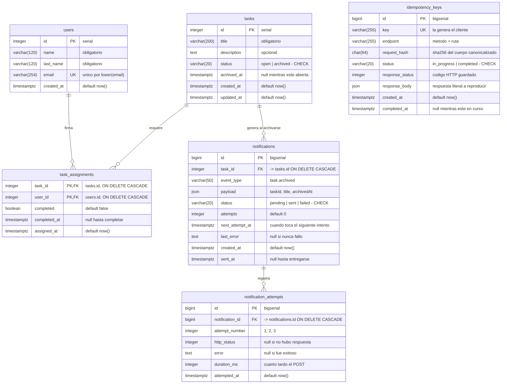

# Modelo de datos

Diagrama entidad-relacion de la base.

El esquema completo, con todos los tipos y restricciones, esta en
[db/schema.sql](../db/schema.sql), generado desde las migraciones con
`pnpm schema:dump`.

## Indices

| Indice | Tabla | Para que |
|---|---|---|
| `uq_users_email` | users | UNIQUE sobre `lower(email)`: hace imposible el duplicado por mayusculas |
| `idx_tasks_status` | tasks | `GET /tasks?status=...` filtra por aqui |
| `idx_task_assignments_user` | task_assignments | `GET /users/:id/tasks` busca por usuario, no por tarea |
| `uq_idempotency_keys_key` | idempotency_keys | UNIQUE: el que hace atomica la reserva de clave |
| `idx_idempotency_keys_created` | idempotency_keys | la purga de claves vencidas |
| `uq_notifications_task_event` | notifications | UNIQUE (task_id, event_type): una notificacion por tarea, garantizado |
| `idx_notifications_pendientes` | notifications | **parcial**: (next_attempt_at) WHERE status = 'pending' |
| `uq_attempts_notification_number` | notification_attempts | evita registrar dos veces el mismo intento |

## Decisiones y por que

**Clave primaria compuesta en `task_assignments`.**
La PK es (task_id, user_id). Eso hace **estructuralmente imposible** asignar dos
veces al mismo usuario en la misma tarea, sin depender de que la aplicacion se
acuerde de comprobarlo. Es lo que permite que `POST /assign` use
ON CONFLICT DO NOTHING y sea idempotente sin escribir logica.

**El `status` de la tarea es un dato derivado.**
Una tarea esta archivada cuando ninguna de sus filas en `task_assignments` tiene
completed = false. Se guarda igualmente en `tasks.status` porque
`GET /tasks?status=` necesita filtrar de forma barata, pero nunca se edita a
mano: solo lo escribe `completeTaskPart`, dentro de la transaccion que toma el
lock de la tarea.

**Indice parcial en `notifications`.**
El despachador solo consulta pendientes. Un indice sobre toda la tabla creceria
con miles de filas `sent` que nunca se leen. El plan de ejecucion confirma que
se usa (Index Scan using idx_notifications_pendientes), y el Index Cond ni
siquiera menciona `status`: el indice ya solo contiene pendientes.

**`json` y no `jsonb`.**
`jsonb` normaliza: descarta espacios y reordena las claves. Para idempotencia el
requisito es devolver una respuesta *identica*, y nunca consultamos dentro del
cuerpo guardado, asi que la unica propiedad que importa es justo la que `jsonb`
destruye. Lo mismo aplica al `payload` de las notificaciones.

**ON DELETE CASCADE en todas las claves foraneas.**
Borrar una tarea se lleva sus asignaciones, sus notificaciones y los intentos de
esas notificaciones. No quedan huerfanos que nadie sabria interpretar.

**`http_status` es nullable.**
Un servicio caido no devuelve codigo HTTP. NULL significa "no hubo respuesta" y
es distinto de un 500, donde el receptor contesto pero con error. Esa distincion
se ve en `GET /tasks/:idTask/notifications`.
